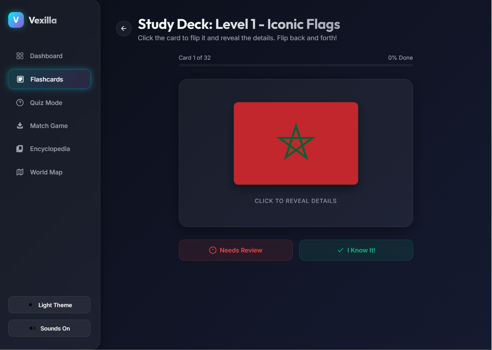
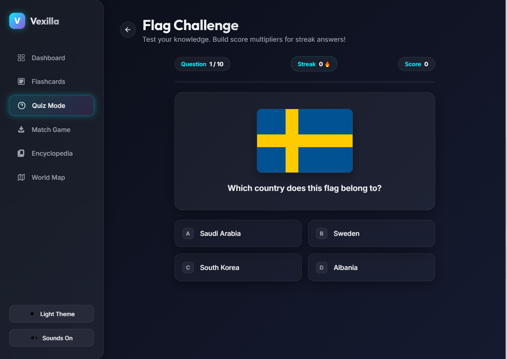
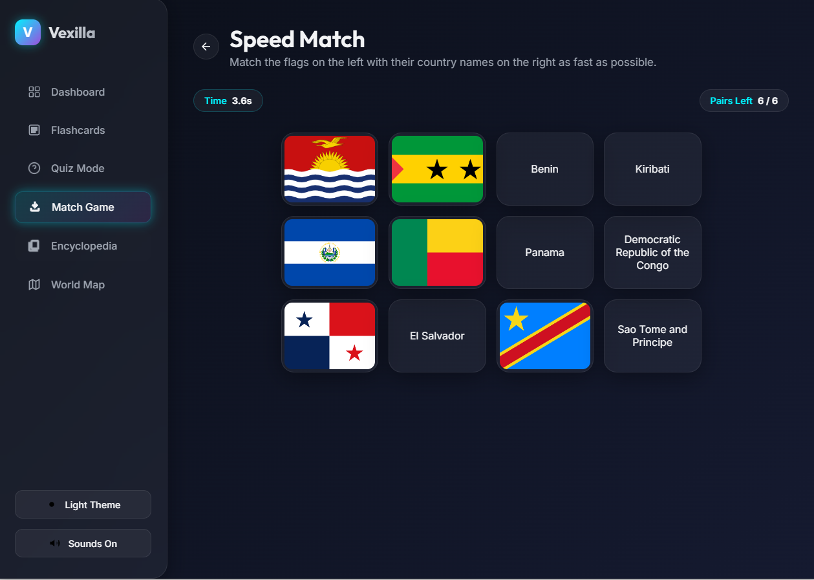
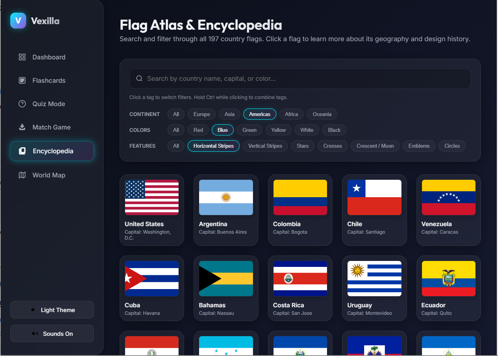
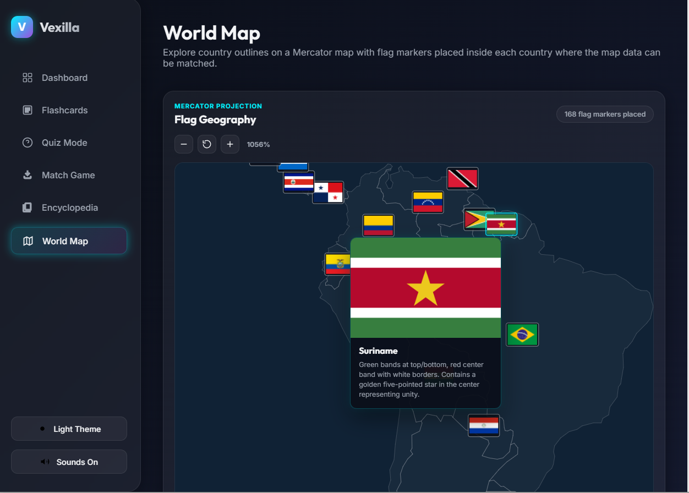

# Vexilla

Learn the flags of the world without turning it into homework.

Vexilla is a browser-based flag learning app with flashcards, quizzes, matching games, a searchable encyclopedia, achievements, progress tracking, and an interactive world map. It is designed for people who want to actually recognize flags in the wild, not just grind through a list of country names once and forget them.

## What Makes It Fun

- **197 country flags** with capitals, continents, difficulty levels, colors, design features, and memory-friendly facts.
- **Progressive learning levels** that start with iconic flags and build toward harder, similar-looking, emblem-heavy designs.
- **Flashcards** with a clean flip interaction, flag details, and "I Know It" / "Needs Review" tracking.
- **Quiz mode** with configurable practice, scoring, streaks, and high score tracking.
- **Speed Match** for quick visual recall by pairing flags with country names.
- **Flag Atlas & Encyclopedia** with search and filters for continent, color, and design features.
- **World Map** view with flag markers placed geographically on a Mercator map, zooming, panning, hover popovers, and clickable flag details.
- **Achievements** to reward study milestones and keep the loop satisfying.
- **Dark and light themes**, plus optional sound effects.
- **Progress backup and restore** so your learning history is not trapped in one browser profile.

## Screens And Modes

### Dashboard

The home base for your learning progress. See mastered flags, quiz high score, daily streak, achievements, and quick access to the main activities.

### Flashcards

Study flags level by level. Flip a card to reveal the country, capital, continent, colors, and a mnemonic-style fact. Mark each flag as learned or needing review.



### Quiz Mode

Test recognition with multiple-choice questions. Vexilla tracks accuracy, score, streaks, and your best result.



### Speed Match

A faster memory challenge: match flags to country names as quickly as possible.



### Encyclopedia

Search the full flag collection by country, capital, or color. Filter by continent, colors, and visual features such as stars, crosses, crescents, stripes, circles, and emblems.

Tip: click one filter pill to switch filters in that category, or hold `Ctrl` while clicking to combine multiple pills.



### World Map

Explore the world visually. The map uses country boundary data and places each matching flag marker near its country. You can zoom, pan, hover for a flag preview and fact, and click a marker to open the full flag detail modal.



## Quick Start

Vexilla runs in your web browser. To start it on your own computer, you need a small helper program called **Node.js**. You do not need to know JavaScript or install any complicated developer tools.

### Step 1: Download Vexilla

On the GitHub page, click the green **Code** button, then choose **Download ZIP**.

After the ZIP file downloads:

1. Open your Downloads folder.
2. Right-click the Vexilla ZIP file.
3. Choose **Extract All**.
4. Open the extracted `vexilla` folder.

### Step 2: Install Node.js

1. Go to [https://nodejs.org](https://nodejs.org).
2. Download the version marked **LTS**.
3. Open the installer.
4. Keep clicking **Next** through the default options.
5. Click **Install**.
6. When it finishes, click **Finish**.

### Step 3: Start Vexilla

On Windows:

1. Open the extracted `vexilla` folder.
2. Double-click `run-game.bat`.
3. A black command window should open and start Vexilla.

You should see a message that says Vexilla is running at:

```text
http://localhost:8000/
```

Leave that command window open while you play. If you close it, Vexilla stops running.

### Step 4: Open The App

Open Chrome, Edge, Firefox, or your favorite browser, then go to:

[http://localhost:8000/](http://localhost:8000/)

To stop Vexilla later, go back to the command window and press `Ctrl+C`, or close the window.

### Already Comfortable With The Command Line?

Vexilla is a static JavaScript app with a tiny zero-dependency local server:

```bash
node server.js
```

No package install or build step is required.

## Project Structure

```text
.
├── index.html   # App markup and views
├── styles.css   # Theme, layout, responsive styling, and map UI
├── app.js       # App controller, state, games, filters, map behavior
├── data.js      # Flag dataset and educational facts
├── server.js    # Tiny local static server
└── README.md
```

## Progress And Backups

Vexilla stores learning progress in browser `localStorage` under `vexilla_state`.

That keeps the app simple and private, but browser profile changes can wipe local data. To protect your progress, use the built-in backup tools in the app settings:

- **Download Backup** saves your progress as a JSON file.
- **Copy Backup** copies the same data to your clipboard.
- **Restore Backup** imports a saved progress JSON file.

Progress backup files are ignored by git with:

```text
vexilla-progress-backup-*.json
```

## Data And Map Notes

Flag images are loaded from FlagCDN using each country's two-letter code. The world map uses D3, TopoJSON, and the `world-atlas` country boundary dataset from jsDelivr.

Some small countries, islands, territories, and geographically complex countries are difficult to place perfectly on a compact world map. Vexilla aims to put markers in useful learning positions, with the encyclopedia and modal available for full detail.

## Tech Stack

- HTML
- CSS
- Vanilla JavaScript
- D3
- TopoJSON
- FlagCDN
- World Atlas TopoJSON
- Node.js standard library for local serving

No build step. No framework. No package install required.

## Ideas For Future Enhancements

- Region-focused map presets for crowded areas like Europe, the Caribbean, and Oceania.
- Spaced repetition scheduling for flags marked as needing review.
- More quiz types, such as country-to-flag, capital-to-flag, and flag-similarity challenges.
- Import/export buttons with named save slots.
- Optional keyboard shortcuts for faster study sessions.

## Why "Vexilla"?

`Vexillum` is Latin for a flag or military standard. Vexilla is a small love letter to vexillology: the study of flags, their symbols, their patterns, and the histories packed into tiny rectangles.

## License

No license has been selected yet. If you plan to reuse or redistribute the project, add an explicit license first.
