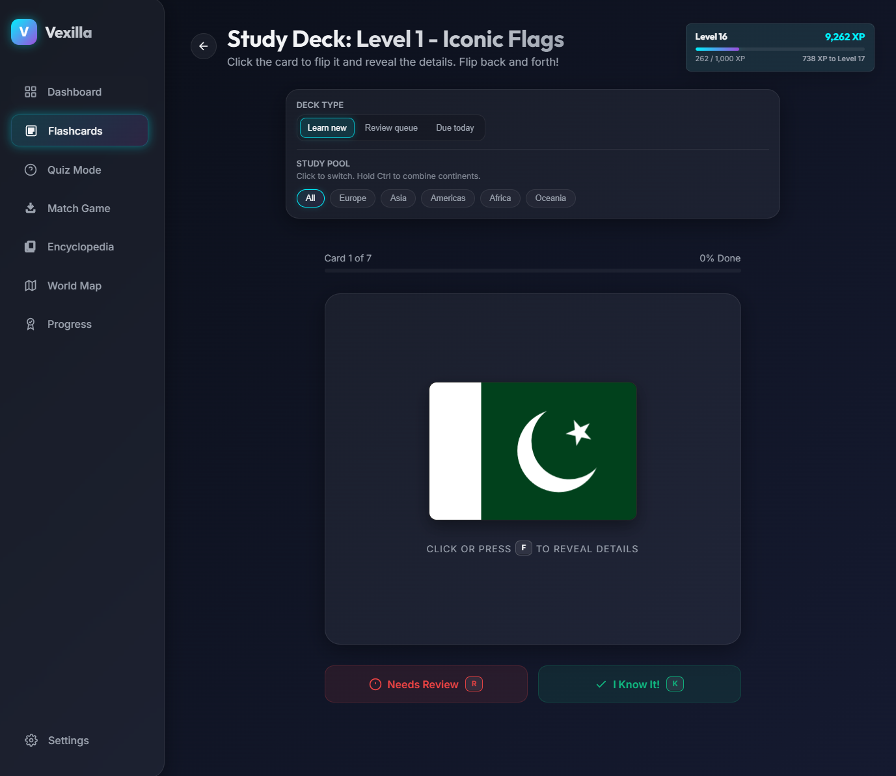
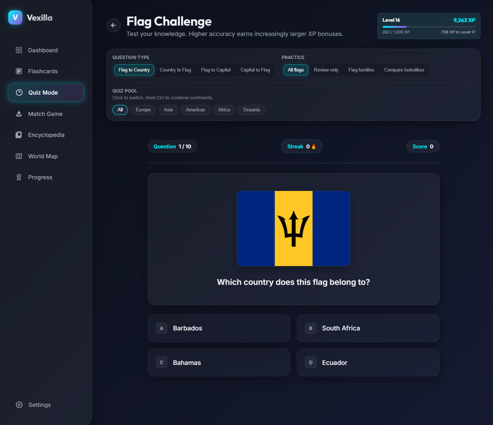
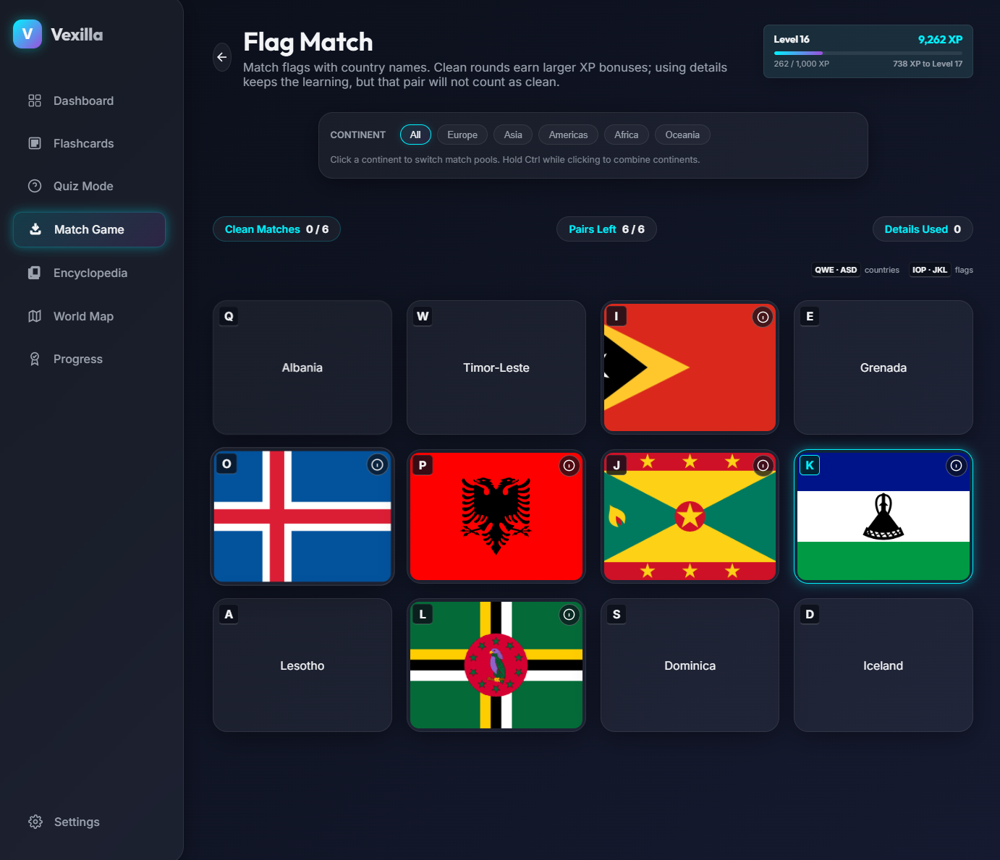
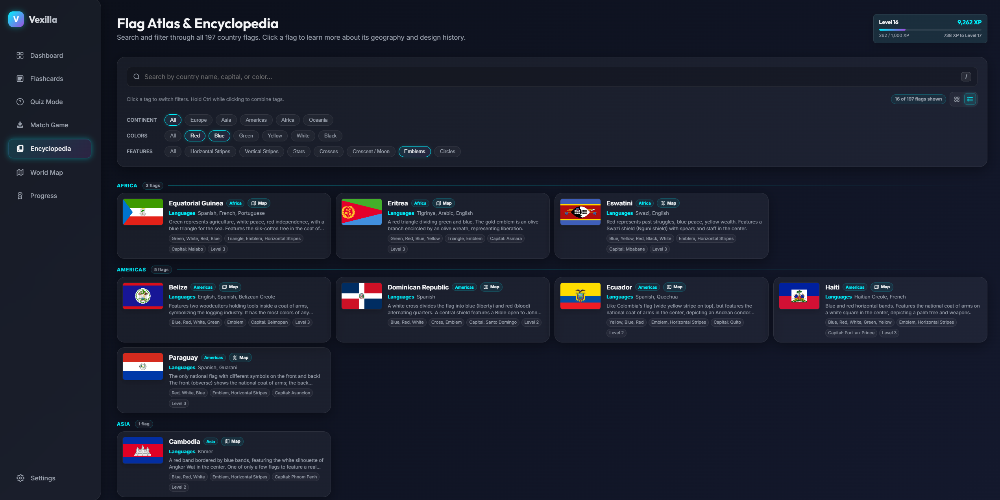
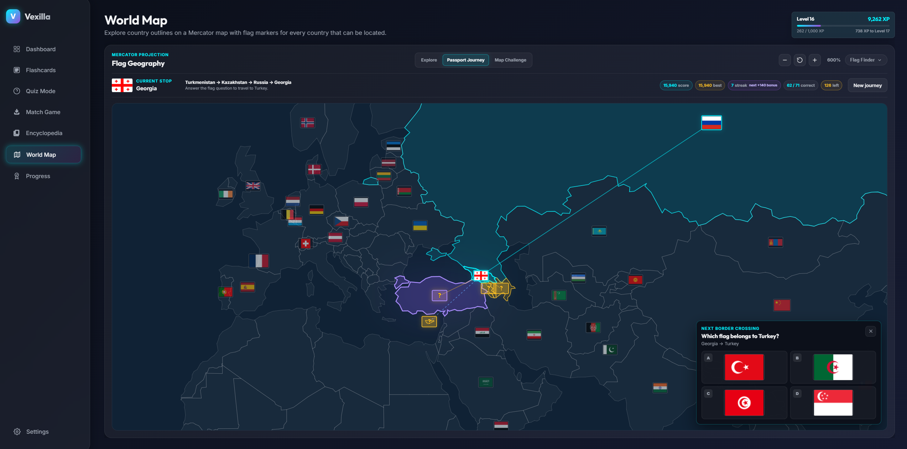

# Vexilla

[](https://flyer1.github.io/vexilla/)


[](https://github.com/flyer1/vexilla)

**Learn every flag in the world without turning it into homework.**

### [Play Vexilla online](https://flyer1.github.io/vexilla/)

No account, installation, command line, or technical knowledge is required. Open the link and start exploring.

Vexilla is a browser-based flag-learning app built around visual memory, geography, repetition, and short games. It combines flashcards, configurable quizzes, matching, a searchable encyclopedia, an interactive world map, XP progression, achievements, and a globe-spanning Passport Journey.

## Passport Journey

Passport Journey is Vexilla's map-based adventure and one of the best ways to turn flag study into a game.

Start from a random country, choose a connected destination, and identify its flag from four carefully selected choices. Each correct answer stamps the destination into your journey and moves you onward across the map.

- Travel through borders, island chains, regional links, and cross-continent routes.
- Reach **all 197 countries**, including tiny island nations that do not have usable map polygons.
- See unvisited destinations as mystery markers so the map cannot reveal the answer.
- Revisit an already discovered country to backtrack without answering it again.
- Use the **Countries Left** navigator when you need a destination; Vexilla groups the list by continent and brightens the route toward your chosen target.
- Build an unlimited correct-answer streak. Every correct answer earns base points plus a growing streak bonus, while a miss resets the streak.
- Chase your best journey score and watch current score, best score, streak bonus, accuracy, and countries remaining.
- Earn Explorer XP for correct answers, with quiz-style accuracy and perfect bonuses awarded at checkpoints.
- Hear a special arrival sound when you reach a destination selected in the navigator.
- Hover over previously discovered flags to study their details, even if your first answer was a lucky guess.
- Unlock Passport Journey achievements for stamps, routes, destinations, repeat journeys, and world exploration.

The route is yours. Cross Europe country by country, island-hop through the Caribbean and Oceania, or find a bridge from one continent to the next.

## Everything You Can Do

### Dashboard

The dashboard is your learning command center:

- Explorer level, total XP, and nonlinear progress toward the next level
- Flags mastered, quiz high score, learning streak, and achievements earned
- A daily learning plan based on flags due for review
- Progress by continent and difficulty level
- A four-week **Learning Pulse** activity grid and sparkline with hover details
- Quick routes back into quizzes and the Match Game

### Flashcards

Build recognition one flag at a time using three deck types:

- **Learn new** for the normal level-based study deck
- **Review queue** for flags you marked as needing more practice
- **Due today** for flags scheduled by Vexilla's spaced-review system

Filter the deck by continent, flip each card, and study the country's languages, capital, story, memory hooks, design family, and location on a pannable and zoomable map. Mark the flag as **I Know It** or **Needs Review** and keep moving.

### Flag Challenge

Create the quiz you want to play:

- **Flag to Country**
- **Country to Flag**
- **Flag to Capital**
- **Capital to Flag**

Practice all flags, focus on your review list, drill a flag family, or use **Compare Lookalikes** for deliberately similar choices. Filter by one continent or combine several with `Ctrl`/`Cmd` click.

Wrong answers pause on a learning card until you choose to continue. At the end of a round, review your accuracy, XP breakdown, and missed flags, then retry only the questions you missed.

### Flag Match

Pair six country names with their flags. Match Game rewards knowledge rather than speed:

- Track correct matches out of the complete set.
- Change your selected country or flag before committing to a pair.
- Open a flag's details when you need help; the pair remains playable but no longer counts as a fully correct match.
- Receive visual and audio feedback for correct and incorrect attempts.
- Earn larger XP rewards for stronger accuracy and a perfect round.
- Play entirely by keyboard with left-hand country keys and right-hand flag keys.

### Flag Atlas & Encyclopedia

Search and study all 197 flags in either **tile** or **list** view.

- Search by country, capital, or color.
- Filter by continent, colors, stripes, stars, crosses, crescents, emblems, and circles.
- Select a single filter with one click or combine filters with `Ctrl`/`Cmd` click.
- Browse results grouped by continent with live per-continent and total counts.
- In list view, compare flags, country outlines, languages, and abbreviated descriptions across a wide layout.
- Open rich flag details or jump directly from a country to its location on the World Map.

Flag learning details can include:

- Languages spoken
- Current design adoption date
- Nickname
- Historical origin
- Independence connection
- Flag family
- Construction or design facts
- Memory hooks
- A focused locator map

### World Map

Explore every flag geographically on a large Mercator map.

- Zoom deeply with the mouse wheel or the `+` and `-` controls.
- Pan with left-click drag or the middle mouse button.
- Hover over a country to highlight its boundary.
- Hover over a flag for an immediate detail card with its larger flag, metadata, learning facts, and locator map.
- Click a flag for the complete detail view.
- Use **Flag Finder** to search all countries and smoothly travel to a selected location.
- View flag markers for all 197 countries, including countries too small to have visible boundaries.

The map has three modes:

1. **Explore** for free geographic study
2. **Passport Journey** for route-based flag adventures
3. **Map Challenge** for locating a prompted country on the map

### Progress & Achievements

Progress is more than a single score. Vexilla tracks:

- Explorer XP and increasingly demanding level thresholds
- Flags practiced and flags due for review
- Accuracy by continent
- Strongest and weakest learning areas
- Frequently missed flags
- Recent study sessions and XP earned
- Passport Journey records and lifetime travel
- Achievement totals and grouped achievement collections

Leveling up produces a dedicated celebration with your new level, latest XP reward, total XP, and progress toward the next milestone.

### Settings

Settings includes:

- Light and dark themes
- Sound effects
- Full or gentle level-up celebration effects
- A complete keyboard-shortcut reference
- Offline preparation
- Progress download, copy, and restore tools
- A custom confirmation dialog for resetting saved data

## Screenshots

<table>
  <tr>
    <td align="center" width="50%">
      <strong>Flashcards</strong><br>
      
    </td>
    <td align="center" width="50%">
      <strong>Flag Challenge</strong><br>
      
    </td>
  </tr>
  <tr>
    <td align="center" width="50%">
      <strong>Flag Match</strong><br>
      
    </td>
    <td align="center" width="50%">
      <strong>Atlas & Encyclopedia</strong><br>
      
    </td>
  </tr>
</table>

<p align="center">
  <strong>Interactive World Map</strong><br>
  
</p>

## XP, Levels, And Motivation

Almost every learning activity contributes to your Explorer XP:

- Quiz and Match rewards scale with performance, not merely participation.
- Accuracy bonuses grow as you approach a perfect round.
- Perfect bonuses account for the size of the question set.
- Passport Journey awards XP for correct crossings and checkpoint performance.
- Higher Explorer levels require progressively more XP.
- A compact XP tracker remains visible on active learning and game screens.

Achievements provide additional goals for mastering continents, maintaining streaks, completing clean matches, exploring the atlas, viewing details, and travelling through Passport Journey.

## Keyboard Friendly

Vexilla can be played without constantly reaching for the mouse. On desktop, shortcut hints appear beside relevant controls; they are hidden on phones where they would only consume space.

| Shortcut | Action |
| --- | --- |
| `Alt+1` through `Alt+7` | Open Dashboard, Flashcards, Quiz, Match, Atlas, Map, or Progress |
| `Alt+S` | Open Settings |
| `F` | Flip a flashcard |
| `K` / `R` | Mark a flashcard known / needing review |
| `A` through `D` | Choose a quiz answer |
| `N` or `Enter` | Continue from a quiz learning card |
| `Q W E / A S D` | Select Match Game country tiles with the left hand |
| `I O P / J K L` | Select Match Game flag tiles with the right hand |
| `/` | Search the Atlas or open Flag Finder on the map |
| `J` / `M` | Open Passport Journey / Map Challenge |
| `+` / `-` / `0` | Zoom in, zoom out, or reset map zoom |
| `Esc` | Close dialogs, details, and overlays |
| `?` | Show a shortcut reminder |

Standard `Tab`, `Shift+Tab`, `Enter`, and `Space` navigation also works throughout the app.

## Mobile And Offline Use

Vexilla has a responsive phone layout with bottom navigation, touch-friendly controls, readable toasts, mobile map defaults, and installable standalone behavior through its web app manifest.

To prepare the hosted app for use without an internet connection:

1. Open **Settings**.
2. Find **Offline Mode**.
3. Select **Prepare Offline** while you still have internet access.
4. Keep the site installed or bookmarked and reopen it later.

The service worker and Cache API store the app shell, map data, libraries, fonts, and flag images in the browser's managed site cache. This is separate from `localStorage`, which holds learning progress.

## Progress And Backups

Progress is stored privately in the current browser under the `vexilla_state` key in `localStorage`. It includes mastered and review flags, quiz and match performance, XP, levels, achievements, settings, recent sessions, spaced-review data, and Passport Journey history.

Browser storage can still be lost when clearing site data, changing browser profiles, reinstalling a browser, or moving to another device. Use the backup tools in **Settings**:

- **Download Backup** saves a JSON progress file.
- **Copy Backup** places the same data on the clipboard.
- **Restore Backup** imports a previously saved Vexilla backup.

Regular backups are especially worthwhile after a long Passport Journey.

## Run Vexilla Locally

The hosted version is the easiest option, but Vexilla can also run from your own computer.

### 1. Download The App

1. Open the [Vexilla repository](https://github.com/flyer1/vexilla).
2. Select the green **Code** button.
3. Select **Download ZIP**.
4. Open your Downloads folder.
5. Right-click the ZIP file and select **Extract All**.
6. Open the extracted `vexilla` folder.

### 2. Install Node.js

Vexilla has no build process or package installation, but its small local web server requires Node.js.

1. Visit [nodejs.org](https://nodejs.org/).
2. Download the version marked **LTS**.
3. Run the installer.
4. Keep the default installer choices.
5. Finish the installation.

### 3. Start Vexilla On Windows

1. Double-click `run-game.bat` inside the extracted folder.
2. Leave the black command window open.
3. Open [http://localhost:8000/](http://localhost:8000/) in your browser.
4. To stop Vexilla, close the command window or press `Ctrl+C` inside it.

The batch file will explain where to install Node.js if it cannot find it.

### Command-Line Option

Developers can start the same server with:

```bash
node server.js
```

Then open [http://localhost:8000/](http://localhost:8000/).

There is no `npm install`, bundler, framework, or build step.

## Project Structure

```text
.
|-- index.html      App markup, views, dialogs, and controls
|-- styles.css      Themes, animation, responsive layout, and map UI
|-- app.js          State, routing, learning modes, games, XP, and map behavior
|-- data.js         Flag metadata and educational learning content
|-- sw.js           Offline service worker and runtime caching
|-- manifest.json   Installable web app metadata
|-- server.js       Zero-dependency local static server
|-- run-game.bat    Double-click Windows launcher
|-- favicon.ico     Browser and installed-app icon
|-- images/         README screenshots
`-- README.md
```

## Technology

Vexilla deliberately stays lightweight:

- Semantic HTML
- Responsive CSS
- Vanilla JavaScript
- D3
- TopoJSON
- World Atlas TopoJSON
- FlagCDN
- Web Audio API
- Service Worker and Cache API
- Web App Manifest
- Node.js standard library for optional local serving

The app has no framework, database, account system, analytics service, package install, or build pipeline.

## Data And Map Notes

Flag images are requested from FlagCDN using each country's two-letter code and cached for reuse. Country boundaries come from the `world-atlas` dataset through jsDelivr and are rendered with D3 and TopoJSON.

Very small countries and islands cannot always be represented by useful polygons at world-map scale. Vexilla supplements boundary data with geographic marker coordinates, locator maps, searchable navigation, and custom Passport Journey connections so those countries remain part of the learning experience.

Flag facts and adoption dates can involve historical nuance: a national flag may have an original adoption date, a later proportion change, or a modern design standard. Vexilla presents the date associated with the current displayed design where the data supports it.

## Deep Links

The browser URL follows the active view and selected state. Links can return directly to modes such as the Atlas, World Map, Passport Journey, filtered quiz pools, and selected countries without requiring a separate server-side router.

## Why "Vexilla"?

`Vexillum` is Latin for a flag or military standard. Vexilla is a small love letter to vexillology: the study of flags, their symbols, their patterns, and the histories packed into tiny rectangles.

## License

No license has been selected yet. Please add an explicit license before reusing or redistributing the project.
